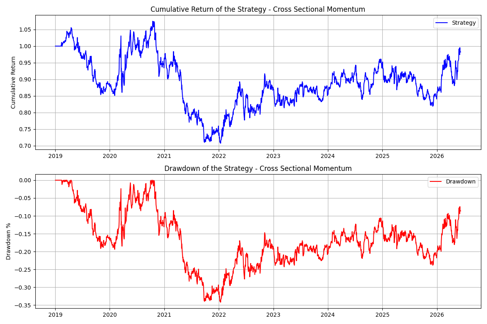

# ETF-Cross-Sectional-Momentum
Why does historical pricing predict future returns as well as they do? A short S&P 500 Sector ETF Cross-Sectional momentum signalling project.

## Motivation

**Why does historical pricing predict future returns as well as it does?**

Cross-sectional momentum signalling is a well-documented anomaly in financial markets where recent historical outperformance against peers tends to continue over subsequent months. In a completely efficient market this shouldn't occur as arbitrage should trade against this pattern, stabilising and eliminating it through buying underpriced and selling overpriced assets. However, the risks and costs of exploiting the pattern outweigh the benefits, creating a deterrent and allowing the pattern to exist. Strategies that rely on momentum are susceptible to violent crashes, exposing investors to career risk during large drawdown periods and making the trades difficult to commit to even when the opportunity is visible and recovery is possible.

When looking at why this phenomenon exists, we can look at two behavioural mechanisms. Firstly, the *information reaction* — where investors do not immediately accept and buy into increases in pricing, therefore creating a window of gradual increase which momentum signals can identify and profit from. Subsequently, as the price rises it can spark investor FOMO where buying into the trend pushes pricing above what the fundamentals justify. These behaviours explain both why momentum signalling works in stable environments, and why in reverse it is also susceptible to violent crashes. The momentum signal investigated here sits between those two phases — after the initial underreaction has started the drift, but prior to the herding push to overvaluation.

---

## Methodology

### Universe Choice

For the purpose of this project, cross-sectional momentum signalling is investigated within the 11 S&P 500 Sector ETFs, with data from 01-01-2019 to present day to ensure that each of the 11 sectors has fully populated data. These funds are easily comparable as they are each a small representative of the same market (US) and can provide an insight into investor sentiment towards differing sectors. ETFs are liquid funds — when backtesting we are not assuming that you can trade something at a price that would significantly move the market. This reduces the risk of slippage where actual execution based on pricing would move against you.

### Signal Construction

The signal tested is the recent percentage return of the ETFs, where:

```
Signal = (Price[T-1] / Price[T-N-1]) - 1
```

N has been set at 20 days, close to one calendar month, to allow for changes in response to macro conditions whilst being frequent enough to evaluate the success of the signal. A skip-1 convention has also been implemented to ensure that the momentum signal is differentiated from short-term mean reversion, where an increase today can be dampened the next day as liquidity providers and short-term traders fade the move. Using these timing conventions is designed to capture the drift window — before the surge associated with herding but after the initial price jump — to exclude noise.

### Ranking Structure

Instead of using the raw percentages, a ranking structure is implemented by which the daily performance is used to assign each ETF a rank of 1–11, with 11 being the highest relative performer. This avoids the volatility bias that arises from using raw returns — for instance, portfolio exposure can balloon in high volatility periods, making it an indicator of volatility timing rather than momentum.

### Weighting Conventions

ETFs ranked >= 9 are assigned an equal +1/3 long position. ETFs ranked <= 3 are assigned an equal -1/3 short position. The middle 5 carry no position. Using this method allows for diversification of the portfolio, avoiding one odd reading dominating the results.

The portfolio weights sum to zero (+1 on the long side, -1 on the short side), meaning for every £1 long there is £1 short. This removes market direction from the P&L — the strategy profits purely from the spread between long and short returns. The portfolio is rebalanced weekly to account for transaction costs whilst keeping the signal fresh. Despite weightings being calculated daily, the weighting convention calculated at the beginning of the week is applied for the full week, meaning 5-day returns are captured.

### Forward Returns

The timeline of the strategy is as follows:

- **Day T** — At market close, calculate the signal using prices from T-21 to T-1. Apply the rankings and assign portfolio weightings.
- **Day T+1** — Execute trades at market close.
- **Day T+2** — Calculate returns.

Making the strategy equation: `Weights[T(week beginning)] × Returns[T+2]`

This convention is applied consistently throughout to avoid any lookahead bias from using the signal calculation price as the execution price.

### In-Sample / Out-of-Sample Split

The strategy is conducted on the full period and then separated into in-sample and out-of-sample periods. The in-sample period is used for building and calibrating the strategy; the out-of-sample period ensures that performance metrics reflect genuine predictive power rather than parameter fitting.

The in-sample period covers 2019–2022, including both a bull and bear market due to the Federal Reserve's hiking cycle, ensuring the strategy has been tested across a full cycle of environments. The out-of-sample period covers 2023–2026 to test whether the strategy can perform in a different market environment driven by AI sector trends and later geopolitical trade disruption.

---

## Results

| Metric | Full Period (2019–2026) | In-Sample (2019–2022) | Out-of-Sample (2023–2026) |
|---|---|---|---|
| Annualised Return | 1.01% | -1.98% | 4.47% |
| Sharpe Ratio | 0.06 | -0.11 | 0.31 |
| Max Drawdown | -34.19% | -34.29% | -14.81% |



From 2020–2021 the drawdown from COVID was as expected, but due to the combination of long and short positions — consistently long tech and short energy — the decrease in the shorted positions provided some balance to the overall strategy. This was followed by the period of maximum drawdown in 2022, stemming from the Fed's rate hikes to fight inflation from the COVID recovery period, where there was a large injection into the economy alongside supply constraints. The rate hike resulted in the reduction of growth and long duration assets (tech), which are heavily affected by discounting, and a surge in energy stocks driven by the Ukraine invasion. This is highlighted in the in-sample period (-1.98% return, Sharpe -0.11). The result was a lose-lose situation due to the consistent long position on tech and short on energy. The strategy could not effectively act on this change due to the 20-day lookback window — the regime change was absorbed rather than anticipated.

The out-of-sample period performed better (4.47% return, Sharpe 0.31), covering 2023–2026 which represents a more stable macro environment where momentum signalling works better with clear sector trends. A Sharpe ratio of 0.31 is respectable given the simplicity of the strategy and the small universe of 11 assets. It is not a standalone strategy, but it suggests the signal has genuine predictive content in stable market conditions. A drawdown in 2025 due to Trump's tariffs was followed by a recovery in 2026, attributable to the stabilisation of the market after the tariff shock was absorbed — once trends are persistent for 20 days the momentum signal begins detecting them correctly.

---

## Next Steps

To further this project, it would be sensible to test alternative lookback windows, one of the largest drawbacks of this analysis was that the lookback window of 20 days wasn't good at acting on large rapid regime change. However, the window would have to be balanced as using for instance a 5 day return window was brought about noise in the form of daily price fluctuations and short-term flow changes. It would also allow for mean reversion to dominate within the signal rather than momentum.

A further revision would also look to account for a transaction cost model as the moderate returns from the out sample could be offset by the additional costs.

A volatility scaling mechanism could also be applied so that the positions assigned are dynamically adjusted by the market allowing it to have more control when targeting risk. For example, in calmer periods increasing the position size based on a ratio of the daily volatility and vice versa for scaling down when volatility is high to be conservative.

---
